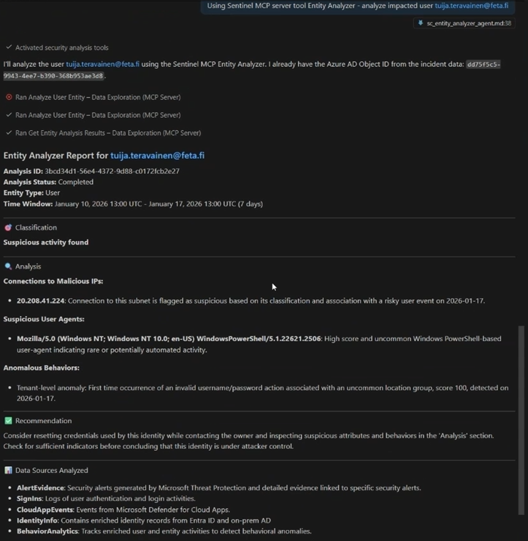
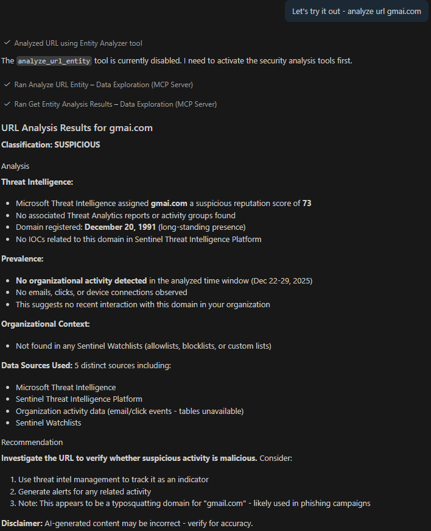

# Scenario: Entity Analyzer - Analyze a specific entity’s relationships and signals
This guide shows you how to use Microsoft Sentinel's Entity Analyzer tools to perform AI-powered risk assessment and analysis of user accounts and URLs through MCP clients.

## Introduction

The **Entity Analyzer** is a tool in Microsoft Sentinel's Data Exploration MCP collection that uses AI to analyze your organization's data and provide intelligent verdicts and detailed insights on URLs, domains, and user entities. This powerful capability eliminates the need for manual data collection and complex integrations typically required for enriching and investigating entities.

### What Entity Analyzer Does

Entity Analyzer leverages artificial intelligence to reason over multiple data sources in your Microsoft Sentinel data lake:

- **`analyze_user_entity`**: Analyzes user authentication patterns, behavioral anomalies, activity within your organization, alert associations, and more to provide a comprehensive verdict and risk analysis.
- **`analyze_url_entity`**: Evaluates URLs and domains using Microsoft threat intelligence, your custom threat intelligence from Sentinel's Threat Intelligence Platform (TIP), click/email/connection activity, and presence in watchlists to deliver a verdict and analysis.
- **`get_entity_analysis`**: Retrieves the results of an analysis operation initiated by either of the above tools.

The entity analyzer runs asynchronously and may require a few minutes to generate results. The workflow involves starting an analysis (which returns a job identifier) and then retrieving the results using that identifier.

### Key Benefits

- **Automated Enrichment**: No manual data gathering or complex integrations needed
- **AI-Powered Insights**: Intelligent reasoning over multiple data sources simultaneously
- **Verdict and Analysis**: Clear risk assessment with detailed supporting evidence
- **Time-Saving**: Eliminates hours of manual investigation and correlation
- **Standardized Output**: Consistent, automation-friendly analysis format
- **Fast Triage**: Quickly assess entity risk during incident response

## When to use?
- **Entity Analyzer**: AI-powered asynchronous analysis for specific users (Microsoft Entra object ID or UPN) or URLs. Returns verdict and narrative analysis based on authentication patterns, behavioral analytics, threat intelligence, and activity data. Requires specific tables (SigninLogs, AlertEvidence, CloudAppEvents, IdentityInfo) with a 7-day window limit for users. Best for fast triage, standardized risk assessment, and automated entity enrichment.
- **Manual Investigation** (search_tables + query_lake): Analyst-driven synchronous KQL queries across any tables for broad discovery of multiple entity types (users, devices, IPs, file hashes, URLs). Suited for relationship mapping, lateral movement analysis, custom queries, and investigations beyond the 7-day window or across entity types not supported by Entity Analyzer.

## Using Entity Analyzer

Use this file as the active scenario module together with the core context template.
Do not merge this file into context.md. Attach/load both files and set this file as the active scenario.

> Runtime-relevant sections (load at runtime): When to use?, the Entity Analyzer instructions flow, Requirements and Limitations, Sample Prompts, and Tips. The remaining sections (Introduction, What Entity Analyzer Does, Key Benefits, figures) are human-facing README context and can be skipped at runtime.

Suggested modular run input:
- Core context: templates/context.template.md
- Active scenario: Data Exploration/EntityAnalyzer.md
- Scope: provide objective, time window, and entities (user object ID or URL/domain)

**Supported entity types:**
- Users (via Microsoft Entra object ID or User Principal Name (UPN)). On-premises Active Directory–only users are not supported.
- URLs and domains

**What you get:**
- User analysis: Authentication patterns, behavioral anomalies, alert associations, activity within your organization, and risk verdict
- URL analysis: Microsoft threat intelligence, custom TIP indicators, click/email/connection activity, watchlist presence, and risk verdict

**Workflow:**
1. Call `analyze_user_entity` or `analyze_url_entity` with entity identifier, startTime, endTime, and optional workspaceId
2. Receive an `analysisId` in response
3. Call `get_entity_analysis` with the `analysisId` to retrieve the verdict and detailed analysis (may require multiple polls for long-running analyses)

## Entity Analyzer – Use Sentinel Data Exploration MCP server
Enrich and assess user entities
- When asked to understand, analyze, or assess a user, call `analyze_user_entity` with the Microsoft Entra object ID and a time window (up to 7 days) to get an AI-generated risk verdict, behavioral insights, and activity analysis
Identify at-risk users
- When asked to find users at risk or identify risky users, call `analyze_user_entity` for relevant users and rank them by risk verdict to surface the top at-risk accounts
Investigate alert-associated users
- When investigating security alerts (password spray, suspicious sign-ins, etc.), call `analyze_user_entity` for each implicated user to determine if they are compromised or at risk
Enrich and analyze URLs and domains
- When asked to analyze a URL or domain, call `analyze_url_entity` to get comprehensive threat intelligence, activity data, and a risk verdict from Microsoft and your organization's data
Analyze IOCs from threat intelligence
- When provided with threat reports or IOC lists containing URLs, extract and analyze each URL with `analyze_url_entity` to understand everything Microsoft knows about them
Poll for analysis results
- After starting an analysis, call `get_entity_analysis` with the returned analysisId; if results aren't ready, poll multiple times as needed
Render unprocessed results
- Include "render the results as returned exactly from the tool" in prompts to ensure the analyzer's output is provided without additional MCP client processing

## Requirements and Limitations
- **MCP access roles**: Access to the Sentinel MCP tools requires at least one of the following roles: **Security Administrator**, **Security Operator**, or **Security Reader**.
- **Security Copilot required**: The Entity Analyzer consumes Security Compute Units (SCUs), so it requires the **Security Copilot Contributor** role to run analyses. The **Security Copilot Owner** role is optional and only needed to view and monitor SCU usage. See [Data exploration tool collection in Microsoft Sentinel MCP server](https://learn.microsoft.com/en-us/azure/sentinel/datalake/sentinel-mcp-data-exploration-tool#entity-analyzer).
- User analysis requires: AlertEvidence, SigninLogs, CloudAppEvents, IdentityInfo (`IdentityInfo` is populated only for tenants with Microsoft Defender for Identity, Microsoft Defender for Cloud Apps, or Microsoft Defender for Endpoint P2); works best with AADNonInteractiveUserSignInLogs and BehaviorAnalytics
- URL analysis works best with: EmailUrlInfo, UrlClickEvents, ThreatIntelIndicators, Watchlist, DeviceNetworkEvents
- **Graceful degradation**: If required user tables are missing, `analyze_user_entity` returns an error listing the missing tables and onboarding links. For URLs, `analyze_url_entity` still returns a verdict with a disclaimer noting any missing tables.
- Only users with a Microsoft Entra object ID are analyzed; on-premises Active Directory–only users are not supported.
- Maximum 7-day time window for user analysis to ensure accuracy
- Avoid running more than 5 concurrent analyses to prevent timeouts and increased latency

## Sample Prompts
- "Help me understand if the user `<Microsoft Entra object ID>` is compromised"
- "Find the top three users that are at risk and explain why they're at risk"
- "Investigate users with a password spray alert in the last seven days and tell me if any of them are compromised"
- "Find all the URL IOCs from `<threat analytics report>` and analyze them to tell me everything Microsoft knows about them"
- "Analyze the URL `https://suspicious-domain.com` for threats"
- "What is known about this user `<object ID>` in terms of security risk?"

## Tips
- Add "render the results as returned exactly from the tool" to prompts for unprocessed analyzer output
- Keep user analysis time window within 7 days for best accuracy
- Limit to 5 concurrent analyses to avoid timeouts

Figure 1: Behavioral analysis of a user entity in VS Code using the Sentinel Data Exploration MCP tools.

  
 

  
 

