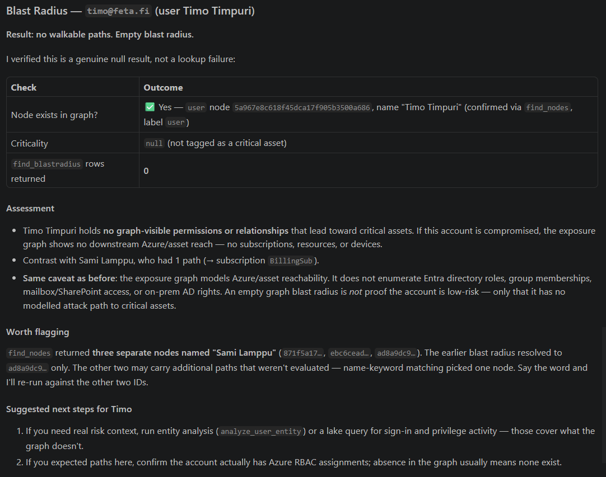
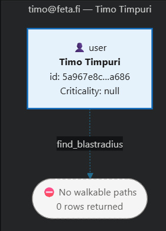

# Scenario: Blast Radius Evaluation

Read the [Graph tools overview and prerequisites](./README.md) before running this scenario.

## Introduction
This scenario provides a modular baseline for evaluating the potential blast radius of a compromised entity with the built-in Microsoft Sentinel graph tool.

Use this file as an instruction module template and tailor it with environment-specific scope, prioritization rules, and output expectations.

## Expected Outputs
- Ranked impacted entities and critical assets.
- Possible propagation paths from the source entity.
- Risk summary and containment priorities.
- Recommended mitigation actions.

## When to use?
- Use when a user, device, service principal, or workload may be compromised.
- Use to estimate downstream risk before containment planning.
- Use during incident triage when impact scope is unclear.

## Scenario Flow & Instructions
Use this file as the active scenario module together with the core context template.
Do not merge this file into context.md. Attach/load both files and set this file as the active scenario.

> Runtime-relevant sections (load at runtime): When to use?, Tool reference, the Blast Radius Evaluation instructions and investigation flow, Constraints, and Sample Prompts. The remaining sections (Introduction, Expected Outputs, Example Investigation Flow, References) are human-facing README context and can be skipped at runtime.

Suggested modular run input:
- Core context: templates/context.template.md
- Shared constraints: Data Exploration/Graph/README.md
- Active scenario: Data Exploration/Graph/BlastRadiusEvaluation.md
- Scope: provide the **source entity** and the investigation objective

## Tool reference

| Tool | Parameters |
|---|---|
| `find_blastradius` | `sourceName` (required) — the **only** parameter |
| `find_nodes` (entity resolution, optional) | `validNodeLabel` (required), `validNodeProperties`, `resultsLimit` |
| `get_graph_context` (only if resolution is ambiguous) | — |

## Blast Radius Evaluation - Instructions and Investigation Flow
Resolve the source entity
- Resolve the source according to the naming and identity guidance in the graph README.
- Confirm the exact node with the analyst when multiple candidates match.

Evaluate blast radius
- Run `find_blastradius` with `sourceName` and collect impacted paths and critical nodes.

Validate critical paths
- Confirm high-risk paths and identify choke points for containment.

Corroborate when needed
- Use `query_lake` or incident evidence separately when the investigation must establish that a path was exercised.

Summarize scope and actions
- Produce an impact summary, prioritized containment order, data gaps, provenance, and recommended next steps.

## Sample Prompts
- "What is the blast radius of user <display name> if compromised, in my graph?"
- "Evaluate downstream impact from device <hostname> to critical assets in my graph."
- "List high-risk propagation paths from <entity> and recommend containment order."

## Example Investigation Flow
Figure 1: Add example screenshot or flow summary.

  

  

